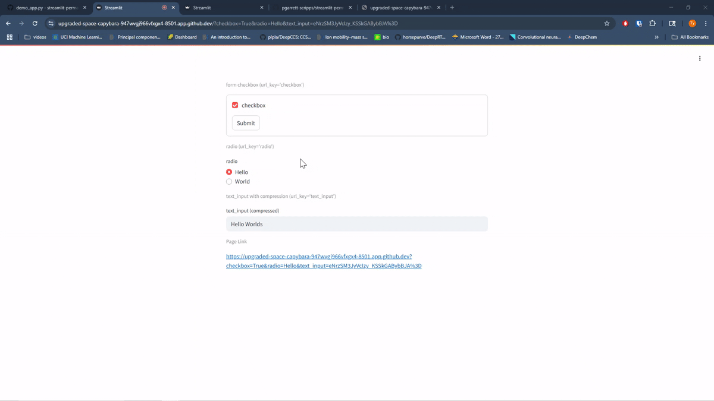

# Effortless permalinks in Streamlit apps

### Installation

```bash
pip install streamlit-permalink-pg
```

### Simple Demo

[Demo App (Click me!)](https://stp-demo.streamlit.app/).



### Interactive Docs App (All stp Widgets)

[Interactive Docs (Click Me!)](https://stp-docs.streamlit.app/).

### Read The Docs

[Read The Docs (Click Me!)](https://streamlit-permalink.readthedocs.io/en/latest/).

### Development and Testing

To set up the development environment and run tests:

1. Install `uv` (if not already installed):

```bash
pip install uv
```

2. Clone the repository and install in editable mode with dev dependencies:

```bash
git clone https://github.com/pgarrett-scripps/streamlit-permalink
cd streamlit-permalink
make install-dev
```

3. Run the tests:

```bash
# Run all tests
make test

# Run tests with coverage
make test-cov

# Run tests in parallel
make test-parallel

# Run a specific test file
uv run pytest tests/test_checkbox.py
```

4. Other useful commands:

```bash
# Format code
make format

# Run linter
make lint

# Type check
make type-check

# Build package
make build

# See all available commands
make help
```
