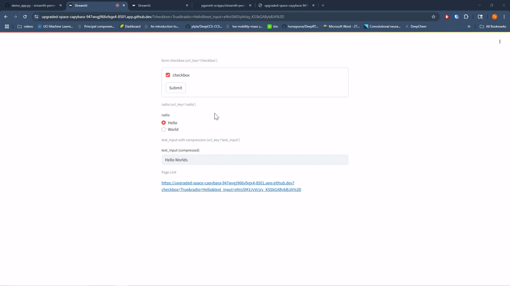

# Effortless permalinks in Streamlit apps

### Installation

```bash
pip install streamlit-permalink-pg
```

### Simple Demo

[Demo App (Click me!)](https://stp-demo.streamlit.app/).




### Interractive Docs App (All stp Widgets)

[Interractive Docs (Click Me!)](https://stp-docs.streamlit.app/).

### Read The Docs

[Read The Docs (Click Me!)](https://streamlit-permalink.readthedocs.io/en/latest/).


### Development and Testing

To set up the development environment and run tests:

1. Clone the repository and install in editable mode with test dependencies:
```bash
git clone https://github.com/pgarrett-scripps/streamlit-permalink
cd streamlit-permalink
pip install -e ".[test]"
```

2. Run the tests:
```bash
# Run all tests
pytest tests

# Run a specific test file
pytest tests/test_checkbox.py
```
